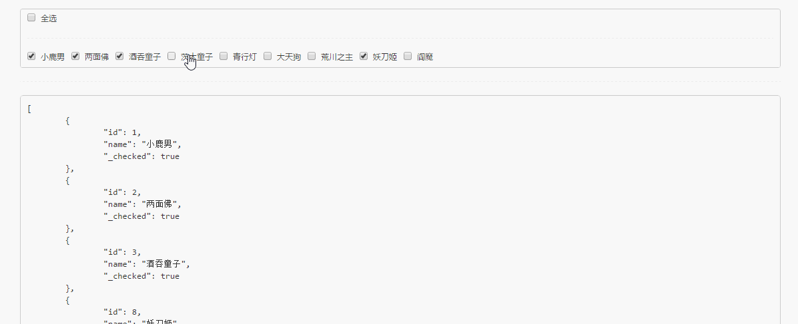

# ct-adc-checkbox-group

> 基于 Vue2.0 的复选框组件

## 目录

- [Build Setup](#build-setup)
- [在线演示](#在线演示)
- [代码示例](#代码示例)
- [API](#api)
    - [props](#props)
    - [emit](#emit)


## Build Setup

``` bash
# install dependencies
npm install

# serve with hot reload at localhost:8080
npm run dev

# build for production with minification
npm run build

# build for production and view the bundle analyzer report
npm run build --report
```

For detailed explanation on how things work, checkout the [guide](http://vuejs-templates.github.io/webpack/) and [docs for vue-loader](http://vuejs.github.io/vue-loader).

## 在线演示

在线演示: [go to live demo](http://htmlpreview.github.io/?https://github.com/ct-adc/ct-adc-checkbox-group/blob/master/view/demo.html).



## 代码示例

```html
<checkbox-group :list="config.list"
                :matchedList="config.matchedList"
                :showKey="config.showKey"
                :matchKey="config.matchKey"
                @change="updateMatchedList"></checkbox-group>
```

```javascript
import CheckboxGroup from 'ct-adc-checkbox-group.vue';

export default {
        components: {
            CheckboxGroup
        },
        data() {
            return {
                config: {
                    showKey: 'name',
                    matchKey: 'id',
                    list: [
                        {
                            id: 1,
                            name: '小鹿男'
                        }
                    ],
                    matchedList: [
                        {
                            id: 1,
                            name: '小鹿男'
                        }
                    ]
                }
            };
        },
        methods: {
            updateMatchedList(aList) {
                this.config.matchedList = aList;
            }
        }
    };
```

## API

#### props

```javascript
// 总列表
list: {
    type: Array,
    default() {
        return [];
    }
},

// 已选择的列表
matchedList: {
    type: Array,
    default() {
        return [];
    }
},

// 需要显示的字段
// 目前只支持一个字段显示
showKey: {
    type: String,
    required: true
},

// 匹配键值[必需唯一]
matchKey: {
    type: String,
    required: true
}
```

#### emit

每次选中修改，都将 `emit` 一个 `change` 事件，并传入当前选中的列表，例如：

```javascript
this.$emit('change', this.getCheckedList());
```